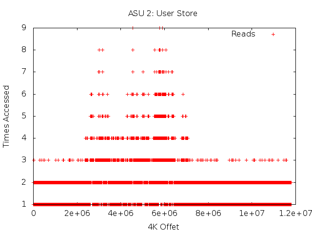
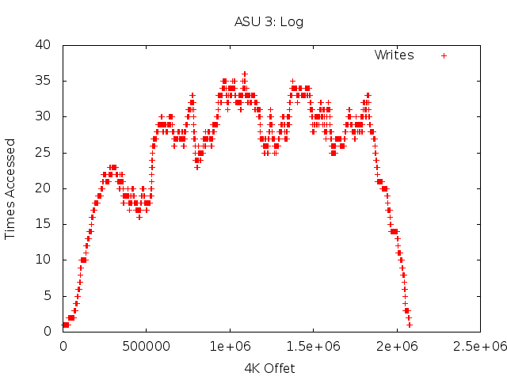

# Overview
I created a simple test file to visualize the I/O pattern of NetApp's spc1 workload.

# IO Pattern
Here is an example IO pattern for a simulation running 50 mil IOs using
HRRW_V2.  The simulation ran with an ASU1 (Data Store) size of 45GB,
ASU1 (User Store) size of 45GB, and ASU3 (Log) size of 10GB.








# NetApp SPC1

```
Copyright 2005-2009 NetApp, Incorporated.  All rights reserved.

Redistribution and use in source and binary forms, with or without
modification, are permitted provided that the following conditions
are met:

1. Redistributions of source code must retain the above copyright
   notice, this list of conditions and the following disclaimer.

2. Redistributions in binary form must reproduce the above copyright
   notice, this list of conditions and the following disclaimer in the
   documentation and/or other materials provided with the distribution.

     THIS SOFTWARE IS PROVIDED BY NETAPP, INCORPORATED
     ``AS IS'' AND ANY EXPRESS OR IMPLIED WARRANTIES, INCLUDING,
     BUT NOT LIMITED TO, THE IMPLIED WARRANTIES OF MERCHANTABILITY
     AND FITNESS FOR A PARTICULAR PURPOSE ARE DISCLAIMED. IN
     NO EVENT SHALL NETAPP, INC. BE LIABLE FOR
     ANY DIRECT, INDIRECT, INCIDENTAL, SPECIAL, EXEMPLARY,
     OR CONSEQUENTIAL DAMAGES (INCLUDING, BUT NOT LIMITED TO,
     PROCUREMENT OF SUBSTITUTE GOODS OR SERVICES; LOSS OF USE,
     DATA, OR PROFITS; OR BUSINESS INTERRUPTION) HOWEVER CAUSED
     AND ON ANY THEORY OF LIABILITY, WHETHER IN CONTRACT, STRICT
     LIABILITY, OR TORT (INCLUDING NEGLIGENCE OR OTHERWISE)
     ARISING IN ANY WAY OUT OF THE USE OF THIS SOFTWARE, EVEN
     IF ADVISED OF THE POSSIBILITY OF SUCH DAMAGE.


```

These files are an open-source abstract, implementation of the SPC-1
worload.

The SPC-1 workload is defined and maintained by the Storage Performance
Council, http://www.storageperformance.org.

While the authors of this implementation have attempted to verify this
implementation, strict conformance with any version of the SPC-1
specification or the official SPC-1 workload generator cannot be
assured.

These files can be used to create applications that approximate the
official SPC-1 workload generator.  However, any such program is not an
SPC-1 workload generator, nor can the results of running such a program
be represented as SPC-1 benchmark results.  SPC-1 benchmark results
must be generated using the official SPC-1 workload generator,
available from the Storage Performance Council.

The authors of this code are interested in any updates or improvements
to these routines.  Please send email if you have updates or
suggestions.

```
	Stephen Daniel
	daniel@netapp.com
	Network Appliance
	July 13, 2005
```
